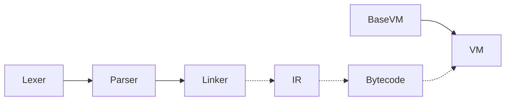

# tyche
A Lua-like programming language (with Go-like syntax)

```mermaid
flowchart LR;
    BaseVM --> VM
    Lexer --> Parser
    Parser --> Linker
    Linker -.-> IR
    IR -.-> Bytecode
    Bytecode -.-> VM
```